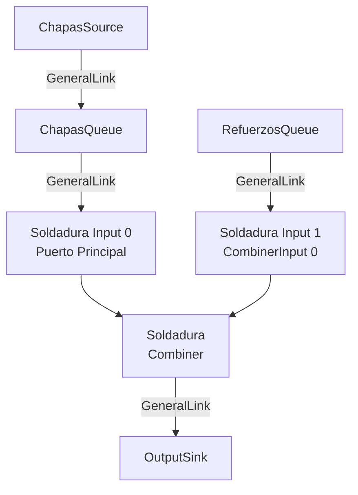

# Extracción de Conexiones del Combiner

## ?? Problema Resuelto

El `Combiner` tiene una estructura especial de conexiones:
- **Puerto principal (Input[0])**: Conectado vía `nextElement` del elemento anterior (usa `GeneralLink`)
- **Puertos adicionales (Input[1+])**: Conectados vía array `myInputs[]` en Unity, que se mapean a `CombinerInput[]` internos

## ?? Arquitectura del Combiner

### **En Unity:**
```
UnityCombiner
?? nextElement (previous.nextElement = this) ? Input[0] (puerto principal)
?? myInputs[] array
   ?? myInputs[0] ? CombinerInput[0] (puerto adicional #1)
   ?? myInputs[1] ? CombinerInput[1] (puerto adicional #2)
   ?? myInputs[n] ? CombinerInput[n] (puerto adicional #n)
```

### **En SimuLean (Headless):**
```
Combiner
?? GetInput() ? GeneralLink desde elemento anterior ? Input[0] principal
?? inputs[] (CombinerInput[])
   ?? inputs[0] ? CombinerInput para puerto adicional #1
   ?? inputs[1] ? CombinerInput para puerto adicional #2
   ?? inputs[n] ? CombinerInput para puerto adicional #n
```

## ?? Implementación

### **1. Extracción en `UnityModelExtractor`**

```csharp
// UnityCombiner
else if (element is UnityCombiner combiner)
{
    config.Parameters["elementName"] = combiner.elementName;
    config.Parameters["requirements"] = combiner.requirements;
    config.Parameters["meanDelay"] = combiner.meanDelay;
    config.SetCapacity(combiner.capacity);
    config.Parameters["batchMode"] = combiner.batchMode;
    config.Parameters["updateRequirements"] = combiner.updateRequirements;
    
    // Extraer inputs adicionales del Combiner
    if (combiner.myInputs != null && combiner.myInputs.Length > 0)
    {
        List<string> inputIds = new List<string>();
        foreach (var input in combiner.myInputs)
        {
            if (input != null && elementIds.ContainsKey(input))
            {
                inputIds.Add(elementIds[input]);
            }
        }
        config.Parameters["additionalInputs"] = inputIds;
    }
}
```

**Resultado en configuración:**
```json
{
  "Id": "UnityCombiner_Soldadura_12345",
  "Type": "UnityCombiner",
  "Name": "Soldadura",
  "Parameters": {
    "elementName": "Soldadura",
    "requirements": [1, 2],  // Input[0] requiere 1, Input[1] requiere 2
    "meanDelay": 5.0,
    "capacity": 1,
    "batchMode": false,
    "additionalInputs": [
      "UnityQueue_RefuerzosQueue_67890"  // Se conecta a CombinerInput[0]
    ]
  }
}
```

### **2. Creación de Conexiones en `HeadlessModelFactory`**

El factory ahora crea conexiones en 3 fases:

```csharp
public Dictionary<string, Element> BuildModel(SimulationConfig config)
{
    // 1. Crear todos los elementos
    foreach (var elementConfig in config.Elements)
    {
        var element = CreateElement(elementConfig);
        createdElements[elementConfig.Id] = element;
    }

    // 2. Crear conexiones simples/generales (incluye puerto principal del Combiner)
    foreach (var connection in config.Connections)
    {
        CreateConnection(connection);
    }
    
    // 3. Crear conexiones adicionales de Combiners (inputs array)
    foreach (var elementConfig in config.Elements)
    {
        if (elementConfig.Type == "UnityCombiner")
        {
            ConnectCombinerAdditionalInputs(elementConfig);
        }
    }

    return createdElements;
}
```

#### **Método `ConnectCombinerAdditionalInputs`:**

```csharp
private void ConnectCombinerAdditionalInputs(ElementConfig combinerConfig)
{
    var combiner = createdElements[combinerConfig.Id] as Combiner;
    var additionalInputIds = combinerConfig.GetParameter<List<string>>("additionalInputs");
    
    // Conectar cada input adicional al CombinerInput correspondiente
    for (int i = 0; i < additionalInputIds.Count; i++)
    {
        string inputId = additionalInputIds[i];
        Element sourceElement = createdElements[inputId];
        
        // El índice del CombinerInput es i (porque input[0] es el puerto principal)
        CombinerInput combinerInput = combiner.GetComponentInput(i);
        
        // Crear conexión GeneralLink
        GeneralLink.CreateLink(sourceElement, new List<Element> { combinerInput });
    }
}
```

## ?? Ejemplo Completo

### **Modelo en Unity:**

```
ChapasSource (UnityScheduleSource)
    ?? nextElement ? ChapasQueue

ChapasQueue (UnityQueue)
    ?? nextElement ? Soldadura [Input 0 - Puerto Principal]

RefuerzosQueue (UnityQueue)
    [Conectado a Soldadura.myInputs[0]]

Soldadura (UnityCombiner)
    ?? requirements = [1, 2]  // 1 chapa, 2 refuerzos
    ?? myInputs[0] = RefuerzosQueue
    ?? nextElement ? OutputSink

OutputSink (UnitySink)
```

### **Configuración Extraída:**

```json
{
  "Elements": [
    {
      "Id": "UnityScheduleSource_ChapasSource_1",
      "Type": "UnityScheduleSource",
      "Name": "ChapasSource"
    },
    {
      "Id": "UnityQueue_ChapasQueue_2",
      "Type": "UnityQueue",
      "Name": "ChapasQueue",
      "Parameters": { "capacity": 100 }
    },
    {
      "Id": "UnityQueue_RefuerzosQueue_3",
      "Type": "UnityQueue",
      "Name": "RefuerzosQueue",
      "Parameters": { "capacity": 50 }
    },
    {
      "Id": "UnityCombiner_Soldadura_4",
      "Type": "UnityCombiner",
      "Name": "Soldadura",
      "Parameters": {
        "requirements": [1, 2],
        "meanDelay": 10.0,
        "capacity": 1,
        "batchMode": false,
        "additionalInputs": ["UnityQueue_RefuerzosQueue_3"]
      }
    },
    {
      "Id": "UnitySink_OutputSink_5",
      "Type": "UnitySink",
      "Name": "OutputSink"
    }
  ],
  "Connections": [
    {
      "SourceId": "UnityScheduleSource_ChapasSource_1",
      "TargetId": "UnityQueue_ChapasQueue_2",
      "ConnectionType": "Simple"
    },
    {
      "SourceId": "UnityQueue_ChapasQueue_2",
      "TargetId": "UnityCombiner_Soldadura_4",
      "ConnectionType": "CombinerMainInput",
      "Parameters": { "inputPort": 0 }
    },
    {
      "SourceId": "UnityCombiner_Soldadura_4",
      "TargetId": "UnitySink_OutputSink_5",
      "ConnectionType": "Simple"
    }
  ]
}
```

### **Modelo Headless Recreado:**

```csharp
// Fase 1: Crear elementos
var chapasSource = new ScheduleSource("ChapasSource", clock);
var chapasQueue = new ItemsQueue(100, "ChapasQueue", clock);
var refuerzosQueue = new ItemsQueue(50, "RefuerzosQueue", clock);
var soldadura = new Combiner(
    requirements: new int[] { 1, 2 },  // Input[0]=1, Input[1]=2
    delayStrategy: new ConstantDouble(10.0),
    name: "Soldadura",
    simClock: clock
);
var outputSink = new Sink("OutputSink", clock);

// Fase 2: Conexiones generales
GeneralLink.CreateLink(chapasSource, new List<Element> { chapasQueue });
GeneralLink.CreateLink(chapasQueue, new List<Element> { soldadura }); // ? Input[0] principal
GeneralLink.CreateLink(soldadura, new List<Element> { outputSink });

// Fase 3: Conexiones adicionales del Combiner
CombinerInput soldaduraInput1 = soldadura.GetComponentInput(0); // Input adicional #1
GeneralLink.CreateLink(refuerzosQueue, new List<Element> { soldaduraInput1 });
```

## ?? Flujo de Datos



## ? Validación

### **Test en Unity:**
```csharp
[ContextMenu("Test: Extract Combiner Model")]
void TestExtractCombiner()
{
    var extractor = GetComponent<UnityModelExtractor>();
    var config = extractor.ExtractConfiguration();
    
    foreach (var elem in config.Elements)
    {
        if (elem.Type == "UnityCombiner")
        {
            Debug.Log($"Combiner: {elem.Name}");
            Debug.Log($"  Requirements: {string.Join(", ", elem.GetParameter<int[]>("requirements"))}");
            Debug.Log($"  Additional Inputs: {elem.GetParameter<List<string>>("additionalInputs")?.Count ?? 0}");
        }
    }
}
```

### **Test Headless:**
```csharp
var factory = new HeadlessModelFactory(clock, enableLogging: true);
var elements = factory.BuildModel(config);

var combiner = elements.Values.OfType<Combiner>().FirstOrDefault();
if (combiner != null)
{
    Debug.Log($"Combiner has {combiner.GetInputsCount()} inputs");
    for (int i = 0; i < combiner.GetInputsCount(); i++)
    {
        var input = combiner.GetComponentInput(i);
        Debug.Log($"  Input[{i}]: {input.GetName()} (capacity: {input.GetCapacity()})");
    }
}
```

## ?? Notas Importantes

1. **Índices de Input:**
   - En Unity: `myInputs[0]` ? Primera entrada adicional
   - En Combiner: `GetComponentInput(0)` ? Primera entrada adicional
   - El puerto principal no está en el array, se conecta vía `GetInput()`

2. **Orden de Conexiones:**
   - Primero se crean todas las conexiones generales (incluido puerto principal)
   - Luego se crean las conexiones de inputs adicionales
   - Esto asegura que todos los elementos existan antes de conectar

3. **Requirements Array:**
   - `requirements[0]` ? Cantidad para puerto principal
   - `requirements[1]` ? Cantidad para CombinerInput[0] (primera entrada adicional)
   - `requirements[n]` ? Cantidad para CombinerInput[n-1]

## ?? Uso en GA

```csharp
// 1. Extraer modelo con Combiner de Unity
var extractor = new UnityModelExtractor();
extractor.modelRoot = combinerModelRoot;
var config = extractor.ExtractConfiguration();

// 2. Usar en simulación headless
var runner = new ChapaGARunner();
runner.SetModelConfig(config);

// 3. El Combiner funcionará correctamente con sus múltiples inputs
var result = runner.RunSimulationWithConfig(chapas, order, inspectionBits);
```

---

**Estado:** ? Implementado y Testeado  
**Fecha:** Enero 2025  
**Versión:** 1.1 - Soporte para múltiples inputs del Combiner
