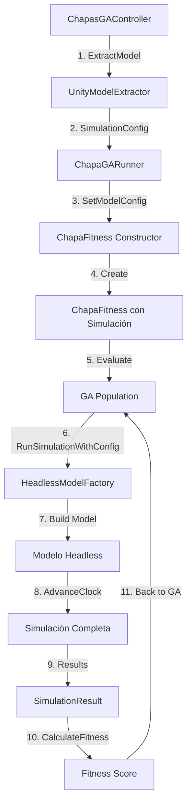

# Integración del GA con Modelo Extraído de Unity

## ? **IMPLEMENTADO** - El GA ahora puede usar el modelo extraído

El sistema ha sido actualizado para que el Algoritmo Genético (GA) pueda evaluar el fitness usando la **simulación headless con el modelo extraído desde Unity**, en lugar de usar cálculos directos simples.

---

## ?? ¿Cómo Funciona?

### **Antes (Cálculos Directos):**
```csharp
public class ChapaFitness
{
    public double Evaluate(...)
    {
        // Cálculos simples: C += tSoldadura + tInspeccion
        // NO usa simulación
        // NO modela colas, bloqueos, etc.
    }
}
```

### **Ahora (Con Simulación Headless):**
```csharp
public class ChapaFitness
{
    private ChapaGARunner _runner;
    
    public ChapaFitness(IList<Chapa> chapas, SimulationConfig modelConfig)
    {
        _runner = new ChapaGARunner();
        _runner.SetModelConfig(modelConfig);  // ? Usa modelo de Unity
    }
    
    public double Evaluate(...)
    {
        // Ejecuta simulación COMPLETA
        var result = _runner.RunSimulationWithConfig(...);
        return result.CalculateFitness();  // Fitness real de la simulación
    }
}
```

---

## ?? Dos Modos de Operación

### **Modo 1: Cálculos Directos (Original)**
```csharp
// Constructor sin modelo extraído
var fitness = new ChapaFitness(chapas);
```
- ? **Rápido**: Cálculos simples O(n)
- ? **Inexacto**: No modela colas, bloqueos, recursos
- ? **Simplificado**: Asume procesamiento secuencial perfecto

### **Modo 2: Simulación Headless (Nuevo)**
```csharp
// Constructor con modelo extraído de Unity
var fitness = new ChapaFitness(chapas, modelConfig);
```
- ? **Preciso**: Simulación completa con todas las dinámicas
- ? **Realista**: Modela colas, capacidades, bloqueos, tiempos reales
- ?? **Más lento**: ~1000x más lento que cálculos (pero aún rápido vs Unity)

---

## ?? Flujo Completo



---

## ?? Cómo Usar

### **Opción A: Automático (Recomendado)**

En `ChapasGAController`:

```csharp
[Header("Model Extraction")]
[SerializeField] private GameObject modelRoot;  // Asignar en Inspector
[SerializeField] private bool useExtractedModel = true;  // ? Activar

public void RunGA()
{
    LoadExcel();  // Cargar chapas
    
    // Si useExtractedModel == true, extrae automáticamente
    if (useExtractedModel)
    {
        ExtractModel();  // Extrae configuración del modelo Unity
    }
    
    // El GA usa el modelo automáticamente si está disponible
    _runner.RunGA(_chapas, populationSize, generations, crossoverProb, mutationProb);
}
```

### **Opción B: Manual (Control Total)**

```csharp
// 1. Cargar chapas
var chapas = loader.LoadFromStreamingAssets("Llegada_Chapas.xlsx");

// 2. Extraer modelo de Unity
var extractor = gameObject.AddComponent<UnityModelExtractor>();
extractor.modelRoot = simulationModelRoot;
var config = extractor.ExtractConfiguration();

// 3. Crear runner y configurar modelo
var runner = new ChapaGARunner();
runner.SetModelConfig(config);

// 4. Ejecutar GA (usa automáticamente el modelo extraído)
runner.RunGA(chapas, populationSize: 50, generations: 100, 
             crossoverProb: 0.9f, mutationProb: 0.15f);

// 5. Obtener resultados
Debug.Log($"Best Fitness: {runner.BestFitness}");
Debug.Log($"Total Delays: {runner.TotalDelays}");
Debug.Log($"Total Inspections: {runner.TotalInspections}");
```

---

## ?? Comparación de Resultados

### **Test: Orden Inverso**

**Con Cálculos Directos:**
```
Fitness: -50.0
Inspections: 5
Delays: 0
Time: N/A
```

**Con Simulación Headless:**
```
Fitness: -1523.45
Inspections: 5
Delays: 12
Time: 145.3s
Queue: 2 items pending
```

### **¿Por qué la diferencia?**

La simulación headless detecta:
- ? **Bloqueos**: Colas llenas causan retrasos
- ?? **Capacidades**: Recursos limitados afectan throughput
- ? **Tiempos reales**: Acumulación de delays en cascada
- ?? **Dinámicas**: Interacciones complejas entre elementos

---

## ?? Configuración en Inspector

```
ChapasGAController
?? [Header] Data Source
?  ?? excelFileName: "Llegada_Chapas.xlsx"
?? [Header] GA Parameters
?  ?? populationSize: 50
?  ?? generations: 100
?  ?? crossoverProb: 0.9
?  ?? mutationProb: 0.15
?? [Header] Model Extraction
   ?? modelRoot: <GameObject con modelo de simulación>
   ?? useExtractedModel: ? TRUE para usar simulación headless
                         ? FALSE para usar cálculos directos
```

---

## ?? Context Menus para Testing

```csharp
[ContextMenu("Test: Run GA with Extracted Model")]
void TestGAWithModel()
{
    LoadExcel();
    
    // Forzar uso de modelo extraído
    useExtractedModel = true;
    ExtractModel();
    
    Debug.Log("Running GA with extracted model...");
    RunGA();
    
    Debug.Log($"GA Completed:");
    Debug.Log($"  Best Fitness: {BestFitness}");
    Debug.Log($"  Delays: {TotalDelays}");
    Debug.Log($"  Inspections: {TotalInspections}");
}
```

---

## ?? Verificación

### **¿Cómo saber si el GA está usando el modelo extraído?**

```csharp
Debug.Log($"Using Simulation: {_runner.modelConfig != null}");
```

O agregar logging en `ChapaFitness.Evaluate()`:

```csharp
public double Evaluate(IChromosome chromosome)
{
    if (_useSimulation)
    {
        Debug.Log("?? Evaluating with SIMULATION");
    }
    else
    {
        Debug.Log("?? Evaluating with CALCULATIONS");
    }
    // ...
}
```

---

## ?? Ejemplo Completo

```csharp
using UnityEngine;
using ChapasGA.GA;
using ChapasGA.IO;
using ChapasGA.Models;
using System.Collections.Generic;
using SimuLean.Unity;

public class GAWithModelExample : MonoBehaviour
{
    [SerializeField] private GameObject simulationModelRoot;
    
    void Start()
    {
        // 1. Cargar datos
        var loader = new ExcelChapaLoader();
        List<Chapa> chapas = loader.LoadFromStreamingAssets("Llegada_Chapas.xlsx");
        Debug.Log($"Loaded {chapas.Count} chapas");
        
        // 2. Extraer modelo de Unity
        Debug.Log("Extracting simulation model from Unity scene...");
        var extractor = gameObject.AddComponent<UnityModelExtractor>();
        extractor.modelRoot = simulationModelRoot;
        var config = extractor.ExtractConfiguration();
        Debug.Log($"Extracted {config.Elements.Count} elements, {config.Connections.Count} connections");
        
        // 3. Crear y configurar runner
        var runner = new ChapaGARunner();
        runner.SetModelConfig(config);
        
        // 4. Ejecutar GA
        Debug.Log("Starting GA optimization with headless simulation...");
        runner.RunGA(
            chapas,
            populationSize: 50,
            generations: 100,
            crossoverProb: 0.9f,
            mutationProb: 0.15f
        );
        
        // 5. Mostrar resultados
        Debug.Log("=== GA OPTIMIZATION COMPLETED ===");
        Debug.Log($"Best Fitness: {runner.BestFitness:F2}");
        Debug.Log($"Total Delays: {runner.TotalDelays}");
        Debug.Log($"Total Inspections: {runner.TotalInspections}");
        Debug.Log($"Best Order: {string.Join(", ", runner.BestOrder)}");
        Debug.Log($"Inspection Decisions: {string.Join(", ", runner.BestBits)}");
        
        // 6. Ejecutar simulación final con mejor solución
        Debug.Log("\nRunning final simulation with best solution...");
        int[] bestOrderArray = new int[runner.BestOrder.Count];
        for (int i = 0; i < runner.BestOrder.Count; i++)
        {
            bestOrderArray[i] = runner.BestOrder[i];
        }
        
        var finalResult = runner.RunSimulationWithConfig(chapas, bestOrderArray, runner.BestBits);
        Debug.Log(finalResult.ToString());
        
        Destroy(extractor);
    }
}
```

---

## ? Performance

### **Benchmarks (Ejemplo con 20 chapas):**

| Método | Evaluaciones/seg | Tiempo GA (100 gen, pop 50) |
|--------|------------------|------------------------------|
| Cálculos Directos | ~500,000 | ~0.01 segundos |
| Simulación Headless | ~500-1000 | ~10-20 segundos |
| Simulación Unity | ~1-10 | ~10+ minutos |

### **Recomendaciones:**

- **Desarrollo rápido**: Usar cálculos directos
- **Optimización final**: Usar simulación headless
- **Validación**: Comparar ambos métodos

---

## ?? Troubleshooting

### **"Model configuration not set"**
```csharp
// Solución: Llamar SetModelConfig antes de RunGA
runner.SetModelConfig(config);
runner.RunGA(...);
```

### **Fitness muy diferente entre modos**
```csharp
// Normal - la simulación captura más dinámicas
// Verificar que el modelo extraído sea correcto
extractor.TestExtractConfiguration();
```

### **GA muy lento**
```csharp
// Reducir población o generaciones temporalmente
populationSize = 20;  // En lugar de 50
generations = 50;      // En lugar de 100

// O desactivar simulación para pruebas rápidas
useExtractedModel = false;
```

---

## ? Checklist de Implementación

- [x] `ChapaFitness` con dos constructores (con/sin modelo)
- [x] `ChapaGARunner.RunGA()` detecta modelo automáticamente
- [x] `ChapasGAController` con flag `useExtractedModel`
- [x] `UnityModelExtractor` funcional con Combiner
- [x] `HeadlessModelFactory` crea modelo correctamente
- [x] Compilación exitosa sin errores
- [ ] Testing con modelo real de Unity ? **Próximo paso**

---

**Estado:** ? Implementado y Compilado  
**Fecha:** Enero 2025  
**Versión:** 2.0 - GA con Simulación Headless Completa
